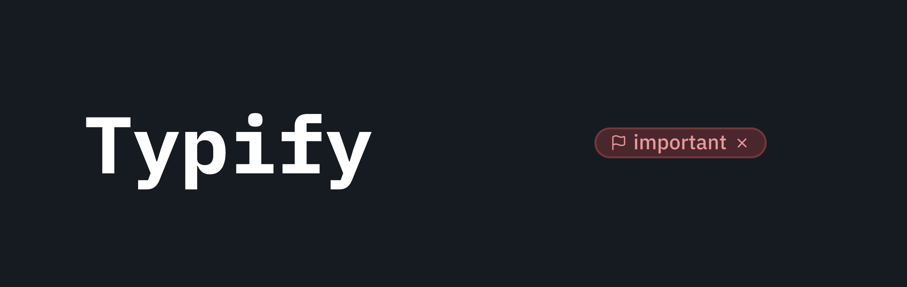

  
  
   
   

   English | [Português](./docs/README_pt.md) | [Español](./docs/README_es.md) | [Français](./docs/README_fr.md) | [简体中文](./docs/README_zh-CN.md)

---

Transform your boring metadata into a dynamic and colorful display! 🎨✨

Typify is an Obsidian plugin that allows you to create unique styles for your metadata. What was once limited to tags can now be customized for any Obsidian property.

## Features

- **🎨 Customizable Styles**: Create unique styles for your metadata.

- **✨ 1700+ Icons**: Built-in fuzzy search for the entire Lucide icon library.

- **🌑 Dark/Light Mode**: Colors automatically adapt to your Obsidian theme.

- **🚫 Optional Icons**: Support for text-only pills (just remove the icon!).

- **🧩 Custom Icons**: Not enough icons? You can easily use your own.

- **🌍 Internationalization**: Fully translated into English, Portuguese (Brazil), Spanish, French, and Simplified Chinese.

- **💾 Export/Import**: Easily backup and share your configurations.

- **📋 Bases Plugin**: Styles also apply to Bases views (table and cards).

- **🎯 Scoped Styles**: Limit a style to specific properties using "Applies To".

## How to Use

1. **Set the target property**: In the plugin settings, type the name of the property you want to style (e.g., `Status`). For multiple properties, separate them with commas (e.g., `Status, Priority`).

2. **Create the value style**:
   - Go to **Settings > Typify**.
   - Click "Create style".
   - In the **Style name** field, type the text you want to turn into a pill (e.g., `Done`).
   - Pick a base color and an icon, or leave it without an icon.
   - Optionally, use **Applies To** to limit the style to specific properties.

3. **Use your new style**: In your note's properties (YAML), use the property and value you configured (e.g., `Status: In Progress`).

Voilá! Your property is now a beautiful colored pill ✨

## Installation

### Manual Installation
1. Download the latest release: `main.js`, `manifest.json`, and `styles.css`.

2. Create a folder called `typify` inside your `.obsidian/plugins/` directory.

3. Paste the files there.

4. Reload Obsidian and enable the plugin.

## Notices

> [!Important]  
> The style effect only applies to properties of type **List** in Obsidian.

> [!Note]  
> The plugin is case-insensitive for both property names and values. Example: `Status` and `status` are treated as the same property.

> [!Note]  
> If two styles share the same name but have different scopes (e.g., one set to "All properties" and another to a specific property), the more specific style will take priority for that property.

> [!Tip]  
> You can use multiple properties as targets. Just add a comma between them. Example: `Status, Priority`.

> [!Warning]  
> Importing settings **replaces all existing styles**. Styles created after the backup will be lost.

## Development

If you want to build the plugin yourself, do the following:

1. Clone this repository.
2. Run `npm install`.
3. Run `npm run dev` to start compilation in watch mode.

## Disclaimer

This plugin was born from my desire to have more customization options for properties, similar to Notion, but the Obsidian way.

It's worth mentioning that without the great help of [Antigravity](https://antigravity.google/) none of this would have been possible. Of course, there was no magic done with a single click—it took careful prompting, lots of review, and testing.

This wasn't "vibe-coded" carelessly. I had to change many things manually, but it's not bulletproof. If you find any bugs, please open an issue and I'll do my best to fix it.

If you want to contribute to the project, feel free to open a pull request. Or if you don't feel comfortable using machine-generated code and want to make your own handcrafted version, feel free to do that too. Just let me know, because I love new plugins 😉.
