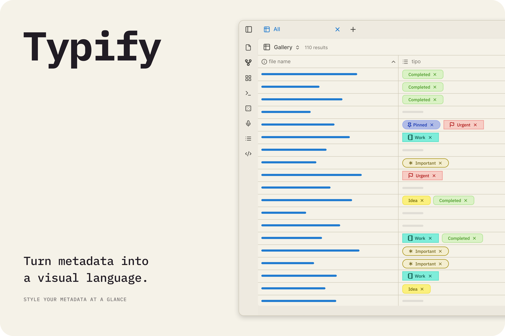

  
  
   
   
   
   

   English 
   | [Portuguese](./docs/README_pt.md) 
   | [Spanish](./docs/README_es.md) 
   | [French](./docs/README_fr.md) 
   | [Simplified Chinese](./docs/README_zh-CN.md)

---

Transform your boring metadata into a dynamic and colorful display! 🎨✨

Typify is an Obsidian plugin that allows you to create unique styles for your metadata. What was once limited to tags can now be customized for any Obsidian property.

## 

Powerful and simple to use, Typify allows you to customize your Obsidian properties any way you want, with a variety of options and features. Some of the features include:

- **Over 1700 icons**
- **Three tag styles and shapes to choose from**
- **Custom icons**
- **Adaptable colors for light and dark mode automatically**
- **Custom links**

✨ Want to see everything Typify can do? Check out the 
[complete list of features and detailed guides](docs/features/README.md).

## 

It's very simple to transform your properties!

1. **In Typify Settings:** Add the property for which you will create custom styles (e.g., `Status`).
2. **Customize:** Click **Create style** and define the name that will be used for the tag, as well as the color, icon (Lucide, emoji or image), shape, and many more options.
3. **In your Notes:** Using the target property defined earlier, insert the created style name next to it and the magic happens instantly! ✨

## 

1. Download the latest release: `main.js`, `manifest.json`, and `styles.css`.

2. Create a folder called `typify` inside your `.obsidian/plugins/` directory.

3. Paste the files there.

4. Reload Obsidian and enable the plugin.

## 
> [!Warning]  
> Importing settings **replaces all existing styles**. Styles created after the backup will be lost.

> [!Warning]  
> The **Minimal** theme has some known layout inconsistencies when used alongside Typify (such as disproportionate font sizes or clipped elements). While I am actively working to mitigate and resolve these limitations in each update, please be aware of these temporary inconsistencies when using this theme.

## 

  
 🤔
    <b>What types of properties are compatible?</b>
  

> Currently, Typify only styles properties of type **list**.

  
  
 🏷️
    <b>Why is a property not being styled?</b>
  

> Check if you added the property in the plugin settings and if it is of type list.

  
 🎨
    <b>Can I use custom icons or Lucide icons?</b>
  

> Yes! The plugin allows you to customize the icon used. You can choose to use Lucide icons, SVG icons of your choice, emojis, or even images. Just remember to enable the icon customization options in the plugin settings. Also, be sure to check the limitations in the plugin's notices panel :D.

  
 📱
    <b>Does Typify work on Obsidian Mobile?</b>
  

> Yes! Typify is compatible with Obsidian Mobile. So don't be afraid to organize your notes.

  
  
 💾
    <b>How does favicon caching work?</b>
  

> Typify locally stores downloaded favicons to display on links. Nothing is updated without the user's express consent.

  
 🌐
    <b>Does Typify send any data to external services?</b>
  

> No. The plugin only communicates with the favicon retrieval service when expressly requested by the user. Some providers are Google and DuckDuckGo (some options are better than others for obtaining favicons).

  
 🧹
    <b>What happens to my properties when I uninstall the plugin?</b>
  

> Nothing. Your properties will continue to exist in your vault, they just won't be styled.

  
 🎭
    <b>Can Typify conflict with CSS themes or snippets?</b>
  

> No, as the plugin does not overwrite any global styles of the theme used, or vice versa.

  
 📋
    <b>How to report an issue or suggest a feature?</b>
  

> If you find any issues, please open an issue in the plugin repository. I will do my best to fix the problem as soon as possible.

## 

Here are some of the features and improvements planned for future updates:

- **🪤 Error Diagnostics**: A panel to diagnose plugin issues and generate a report to facilitate troubleshooting.
- **🏳️‍🌈 Multiple Colors**: New panel to have and manage multiple color cards.
- **🎲 Numeric Tags**: Expansion of Typify style to the number type, allowing the creation of custom styles for number tags. *(Evaluating)*
- **🔮 Pill Padding**: Adjust the size and length of the pills, as well as the font and icon size. *(Frozen)*
- **📊 Reference Pills**: Display the total amount of references that information has in your vault instead of showing an icon (e.g., an author tag showing "X" references). *(Frozen)*

## 

If you want to build the plugin locally, do the following:

1. Clone this repository.
2. Run `npm install`.
3. Run `npm run dev` to start compilation in watch mode.

## 

This plugin was born from my desire to have more customization options for properties, similar to Notion, but the Obsidian way.

It's worth mentioning that without the great help of [Antigravity](https://antigravity.google/) none of this would have been possible. Of course, there was no magic done with a single click—it took careful prompting, lots of review, and testing.

This wasn't "vibe-coded" carelessly. I had to change many things manually, but it's not bulletproof. If you find any bugs, please open an issue and I'll do my best to fix it.

If you want to contribute to the project, feel free to open a pull request. Or if you don't feel comfortable using machine-generated code and want to make your own handcrafted version, feel free to do that too. Just let me know, because I love new plugins 😉.
