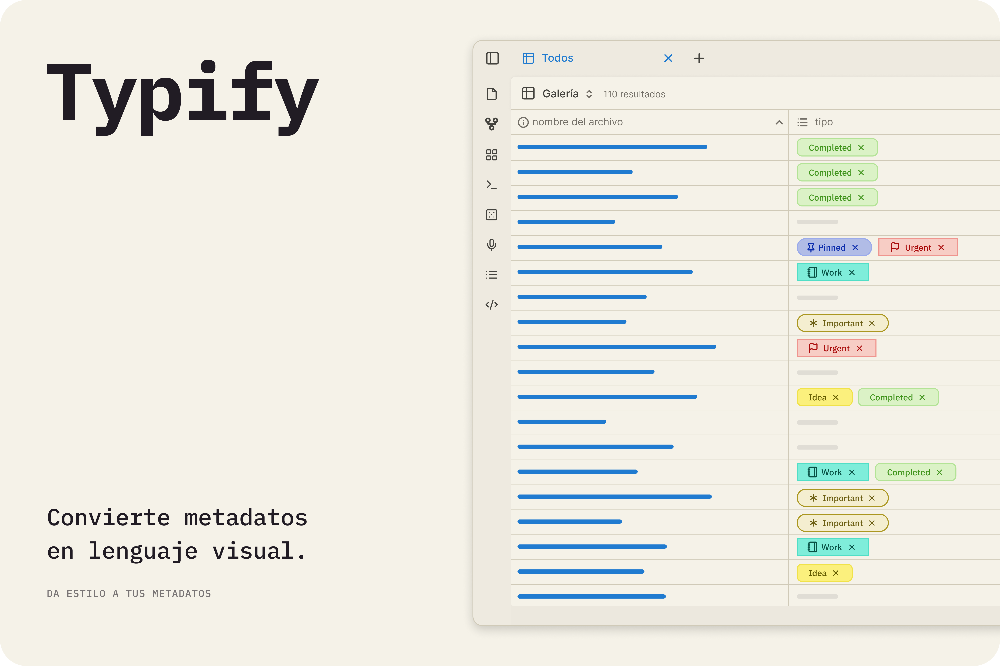
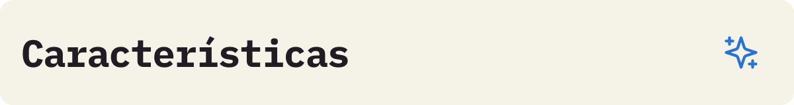
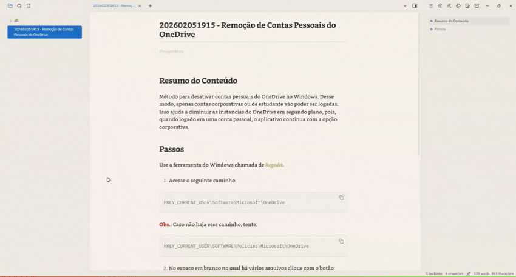
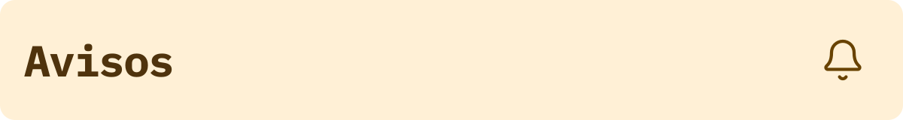
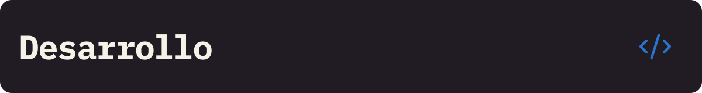

  
  
   
   
   
   

   [Inglés](../README.md) 
   | [Portugués](./README_pt.md) 
   | Español 
   | [Francés](./README_fr.md) 
   | [Chino Simplificado](./README_zh-CN.md)

---

¡Transforma la visualización de tus metadatos aburridos en una visualización dinámica y colorida! 🎨✨

Typify es un plugin para Obsidian que te permite crear estilos únicos para tus metadatos. Lo que antes estaba limitado a las etiquetas, ahora puede personalizarse para cualquier propiedad de Obsidian.

## 

Potente y fácil de usar, Typify te permite personalizar tus propiedades de Obsidian de la manera que desees, con una variedad de opciones y características. Algunas de las características incluyen:

- **Más de 1700 íconos**
- **Tres estilos de etiquetas y formas para elegir**
- **Íconos personalizados**
- **Colores adaptables para modo claro y oscuro automáticamente**
- **Enlaces personalizados**

✨ ¿Quieres ver todo lo que Typify puede hacer? Consulta la 
[lista completa de características y guías detalladas](features/README_es.md).

## 

¡Es muy simple transformar tus propiedades!

1. **En la configuración de Typify:** Agrega la propiedad para la cual vas a crear estilos personalizados (ej., `Estado`).
2. **Personaliza:** Haz clic en **Crear estilo** y define el nombre que se usará para la etiqueta, así como el color, ícono (Lucide, emoji o imagen), forma y muchas más opciones.
3. **En tus Notas:** Usando la propiedad objetivo definida anteriormente, inserta junto a ella el nombre del estilo creado ¡y la magia ocurrirá instantáneamente! ✨

## 

1. Descarga la última versión: `main.js`, `manifest.json` y `styles.css`.

2. Crea una carpeta llamada `typify` dentro del directorio `.obsidian/plugins/`.

3. Pega los archivos allí.

4. Recarga Obsidian y activa el plugin.

## 
> [!Warning]  
> La importación de configuraciones **reemplaza todos los estilos existentes**. Los estilos creados después del respaldo se perderán.

> [!Warning]  
> El tema **Minimal** presenta algunas inconsistencias de diseño conocidas cuando se usa junto con Typify (como tamaños de fuente desproporcionados o elementos recortados). Aunque estoy trabajando activamente para mitigar y resolver estas limitaciones en cada actualización, ten en cuenta estas inconsistencias temporales al usar este tema.

## 

  
 🤔
    <b>¿Qué tipos de propiedades son compatibles?</b>
  

> Actualmente Typify solo estiliza propiedades de tipo **lista**.

  
  
 🏷️
    <b>¿Por qué una propiedad no se está estilizando?</b>
  

> Verifica si agregaste la propiedad en la configuración del plugin y si es de tipo lista. 

  
 🎨
    <b>¿Puedo usar iconos personalizados o de Lucide?</b>
  

> ¡Sí! El plugin permite personalizar el icono usado. Puedes elegir usar los iconos Lucide, iconos svg de tu preferencia, emojis o incluso imágenes. Ah, pero recuerda activar las opciones de personalización de iconos en la configuración del plugin. Además de consultar las limitaciones en el panel de avisos del plugin :D.

  
 📱
    <b>¿Typify funciona en Obsidian Mobile?</b>
  

> ¡Sí! Typify es compatible con Obsidian Mobile. Así que no tengas miedo de organizar tus notas.

  
  
 💾
    <b>¿Cómo funciona el caché de favicons?</b>
  

> Typify almacena localmente favicons descargados para mostrar en los enlaces. Nada se actualiza sin el consentimiento expreso del usuario.

  
 🌐
    <b>¿Typify envía algún dato a servicios externos?</b>
  

> No. El plugin solo se comunica con el servicio de recuperación de favicons cuando el usuario solicita expresamente la búsqueda. Algunos proveedores son Google y DuckDuckGo (algunas opciones son mejores que otras para obtener favicons).

  
 🧹
    <b>¿Qué pasa con mis propiedades al desinstalar el plugin?</b>
  

> Nada. Tus propiedades seguirán existiendo en tu bóveda, solo que no estarán estilizadas. 

  
 🎭
    <b>¿Puede Typify entrar en conflicto con temas o snippets CSS?</b>
  

> No, ya que el plugin no sobrescribe ningún estilo global del tema utilizado o viceversa.

  
 📋
    <b>¿Cómo reportar un problema o sugerir una función?</b>
  

> Si encuentras algún problema, por favor, abre un issue en el repositorio del plugin. Haré lo mejor posible para solucionar el problema rápidamente.

## 

Aquí tienes algunas de las características y mejoras planeadas para futuras actualizaciones:

- **🪤 Diagnóstico de Errores**: Un panel para diagnosticar problemas del plugin y generar un informe para facilitar la resolución de problemas.
- **🏳️‍🌈 Múltiples Colores**: Nuevo panel para tener y administrar múltiples tarjetas de colores.
- **🎲 Etiquetas Numéricas**: Expansión del estilo Typify al tipo número, permitiendo la creación de estilos personalizados para etiquetas numéricas. *(Evaluando)*
- **🔮 Padding de la Píldora**: Ajusta el tamaño y la longitud de las píldoras, así como el tamaño de la fuente y del ícono. *(Congelado)*
- **📊 Píldoras de Referencia**: Mostrar la cantidad total de referencias que tiene esa información en tu bóveda en lugar de mostrar un ícono (ej: una etiqueta de autor que muestre "X" referencias). *(Congelado)*

## 

Si quieres compilar el plugin localmente, haz lo siguiente:

1. Clona este repositorio.
2. Ejecuta `npm install`.
3. Ejecuta `npm run dev` para iniciar la compilación en modo watch.

## 

Este plugin nació de mi deseo de tener más opciones de personalización para las propiedades, similar a Notion, pero al estilo Obsidian.

Vale mencionar que sin la gran ayuda de [Antigravity](https://antigravity.google/) nada de esto habría sido posible. Por supuesto, no hubo magia con un solo clic, sino cuidado con cada prompt, además de mucha revisión y pruebas.

Esto no fue "vibecodado" de cualquier manera. Tuve que cambiar varias cosas manualmente, pero no es a prueba de balas. Si encuentras algún bug, por favor abre un issue y haré lo máximo posible para corregirlo.

Si quieres contribuir al proyecto, no dudes en abrir un pull request. O si no te sientes cómodo usando código generado por máquina y quieres hacer tu propia versión hecha a mano, siéntete libre de hacerlo también. Solo avísame, porque me encantan los plugins nuevos 😉.
