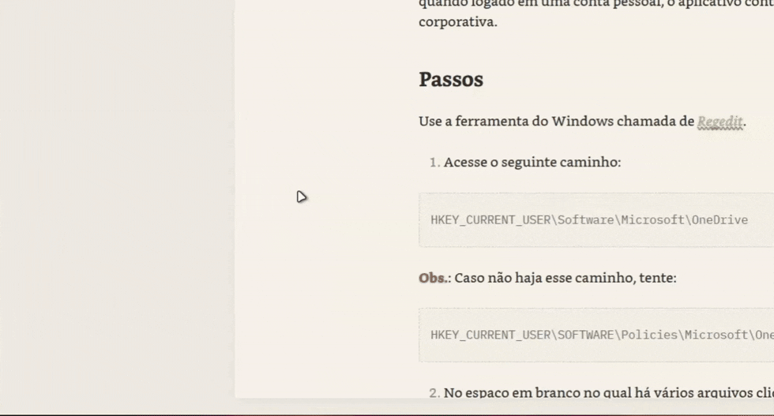
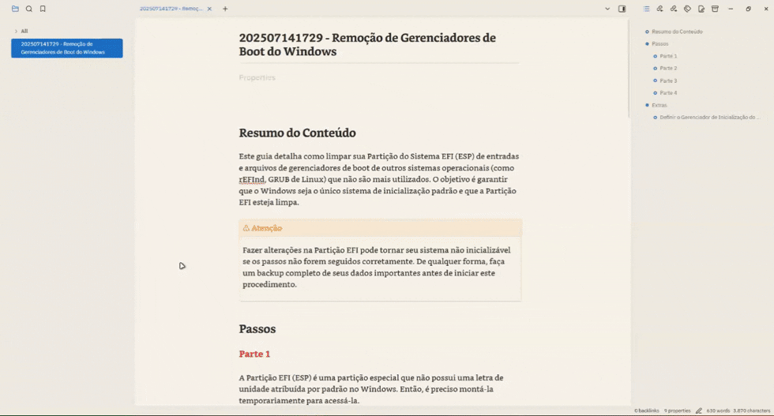

  
  
   
   

   [English](../README.md) | [Português](./README_pt.md) | Español | [Français](./README_fr.md) | [简体中文](./README_zh-CN.md)

---

¡Transforma la visualización de tus metadatos aburridos en una visualización dinámica y colorida! 🎨✨

Typify es un plugin para Obsidian que te permite crear estilos únicos para tus metadatos. Lo que antes estaba limitado a las etiquetas, ahora puede personalizarse para cualquier propiedad de Obsidian.

## Características

- **🎨 Estilos personalizables**: Crea estilos únicos para tus metadatos.

- **✨ 1700+ íconos**: Búsqueda fuzzy integrada para toda la biblioteca de íconos Lucide.

- **🌑 Modo claro/oscuro**: Los colores se adaptan automáticamente a tu tema de Obsidian.

- **🚫 Íconos opcionales**: Soporte para píldoras solo con texto (¡simplemente quita el ícono!).

- **🧩 Íconos personalizados**: ¿Pocos íconos? Puedes usar los tuyos fácilmente.

- **🌍 Internacionalización**: Totalmente traducido a inglés, portugués (Brasil), español, francés y chino simplificado.

- **💾 Exportar/Importar**: Haz copias de seguridad y comparte tus configuraciones fácilmente.

- **📋 Plugin Bases**: Los estilos también funcionan en las vistas de Bases (tabla y tarjetas).

- **🎯 Estilos por propiedad**: Limita un estilo a propiedades específicas usando "Aplica a".

- **🖼️ Etiquetas con Imágenes**: Sube tus propias imágenes locales (PNG, JPG, SVG) para usarlas como avatares de contacto o íconos personalizados.

- **👁️ Ocultar Botón de Eliminar**: Oculta estéticamente el botón "X" globalmente o por vista para crear píldoras de solo lectura.

- **♾️ Soporte para Canvas**: Totalmente compatible con Obsidian Canvas, renderizando los estilos dinámicamente.

- **🔗 Enlaces Asociados**: Reemplaza las URL en las píldoras por el nombre del estilo, manteniendo el comportamiento de clic nativo.

- **😀 Iconos de Emojis**: Soporte para seleccionar y utilizar emojis nativos directamente como iconos en las píldoras.

- **🎨 Paleta de colores**: Guarda tus colores favoritos o usa los ajustes preestablecidos de armonía inteligente para crear paletas perfectas en tiempo real.

- **🌐 Favicons de enlaces**: Asocia automáticamente favicons reales de sitios web a tus etiquetas de enlaces asociados, con un administrador seguro de caché local.

- **📰 Tablero de novedades**: Sigue las actualizaciones y mejoras de Typify directamente desde la configuración del plugin, en tu propio idioma.

## Cómo Usar

¡Es muy simple transformar tus propiedades!

1. **En la configuración de Typify:** Agrega la propiedad para la cual vas a crear estilos personalizados (ej., `Estado`).
2. **Personaliza:** Haz clic en **Crear estilo** y define el nombre que se usará para la etiqueta, así como el color, ícono (Lucide, emoji o imagen), forma y muchas más opciones.
3. **En tus Notas:** Usando la propiedad objetivo definida anteriormente, inserta junto a ella el nombre del estilo creado ¡y la magia ocurrirá instantáneamente! ✨

### 🔗 Enlaces Asociados

Typify te permite crear enlaces de propiedades mucho más limpios. En lugar de ver una URL fea `https://...`, ¡puedes asociarla a un Estilo!
Si el nombre de tu estilo es "Google Traductor" y el valor asociado en *Valor Coincidente* es la URL `https://translate.google.com/`, el plugin ocultará la URL y renderizará perfectamente el nombre "Google Traductor" como una píldora en la que se puede hacer clic.

## Instalación

### Instalación Manual
1. Descarga la última versión: `main.js`, `manifest.json` y `styles.css`.

2. Crea una carpeta llamada `typify` dentro del directorio `.obsidian/plugins/`.

3. Pega los archivos allí.

4. Recarga Obsidian y activa el plugin.

## Avisos

> [!Warning]  
> La importación de configuraciones **reemplaza todos los estilos existentes**. Los estilos creados después del respaldo se perderán.

> [!Warning]  
> El tema **Minimal** presenta algunas inconsistencias de diseño conocidas cuando se usa junto con Typify (como tamaños de fuente desproporcionados o elementos recortados). Aunque estoy trabajando activamente para mitigar y resolver estas limitaciones en cada actualización, tenga en cuenta estas inconsistencias temporales al usar este tema.

## Roadmap

Aquí están algunas de las características y mejoras planificadas para futuras actualizaciones:

- **🎨 Píldoras Simples**: Estilos minimalistas y sin color. Se pueden configurar o aplicar automáticamente a valores no definidos en propiedades estilizadas.
- ~~**📊 Píldoras de Referencia**: Mostrar la cantidad total de referencias que tiene esa información en tu bóveda en lugar de mostrar un icono (ej: una etiqueta de autor que muestre "X" referencias).~~ --> Inviable :/ (Debido a limitaciones de rendimiento)
- ~~**🔗 Simplificación de Enlaces**: Limpiar y acortar URLs externas mostradas en las píldoras de forma automática (ej: `www.google.com` simplificado a `google.com`).~~ --> ¡Implementado de otra manera! :D
- ~~**🌐 Iconos de Favicon**: Opción para buscar y mostrar automáticamente el favicon de un sitio web para enlaces externos que no tengan un icono personalizado configurado.~~ --> ¡Implementado! :D
- ~~**🗂️ Nueva Interfaz de Gestión**: Reemplazar la larga lista de estilos por un diseño basado en pestañas (tabs) similar al utilizado en el modal de búsqueda de iconos, con soporte para desplazamiento horizontal.~~ --> ¡Implementado! :D
- ~~**😀 Iconos de Emojis**: Soporte para seleccionar y utilizar emojis nativos directamente como iconos en las píldoras.~~ --> ¡Implementado! :3

## Desarrollo

Si quieres compilar el plugin tú mismo, haz lo siguiente:

1. Clona este repositorio.
2. Ejecuta `npm install`.
3. Ejecuta `npm run dev` para iniciar la compilación en modo watch.

## Aviso Legal

Este plugin nació de mi deseo de tener más opciones de personalización para las propiedades, similar a Notion, pero al estilo Obsidian.

Vale mencionar que sin la gran ayuda de [Antigravity](https://antigravity.google/) nada de esto habría sido posible. Por supuesto, no hubo magia con un solo clic, sino cuidado con cada prompt, además de mucha revisión y pruebas.

Esto no fue "vibecodado" de cualquier manera. Tuve que cambiar varias cosas manualmente, pero no es a prueba de balas. Si encuentras algún bug, por favor abre un issue y haré lo máximo posible para corregirlo.

Si quieres contribuir al proyecto, no dudes en abrir un pull request. O si no te sientes cómodo usando código generado por máquina y quieres hacer tu propia versión hecha a mano, siéntete libre de hacerlo también. Solo avísame, porque me encantan los plugins nuevos 😉.
