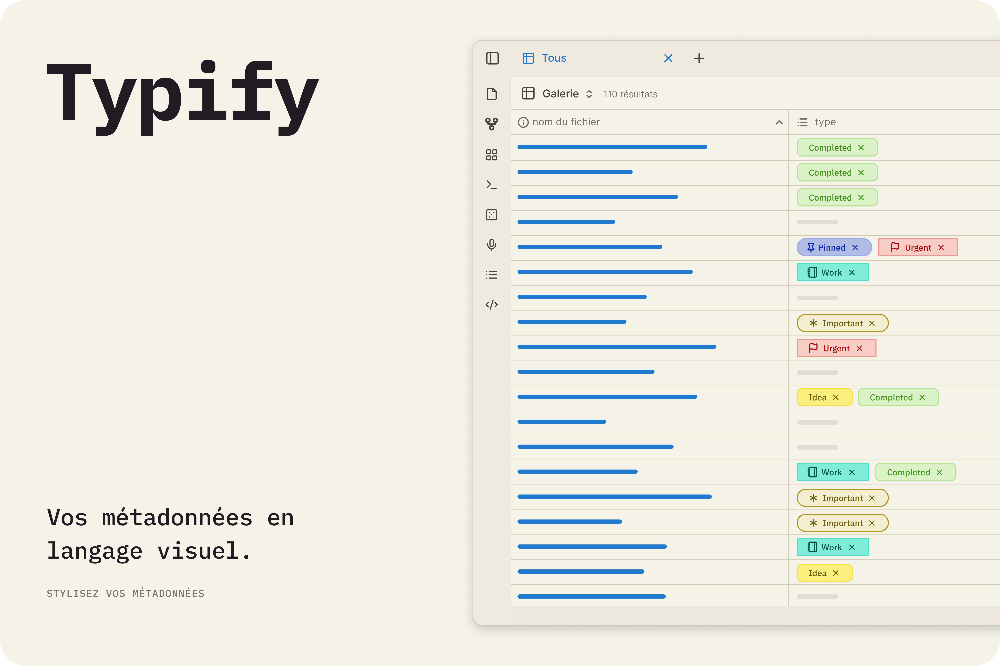
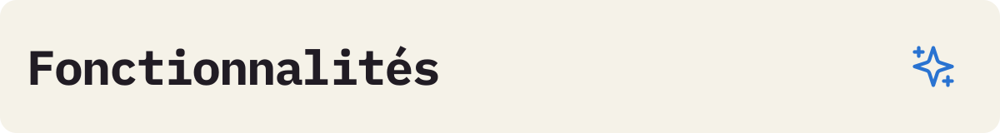
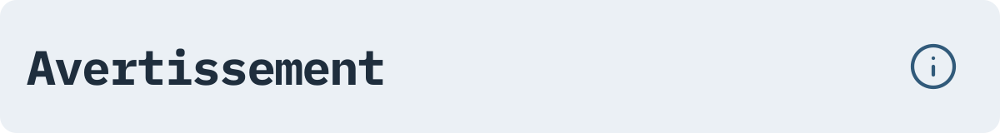

  
  
   
   
   
   

   [Anglais](../README.md) 
   | [Portugais](./README_pt.md) 
   | [Espagnol](./README_es.md) 
   | Français 
   | [Chinois Simplifié](./README_zh-CN.md)

---

Transformez l'affichage de vos métadonnées ennuyeuses en un affichage dynamique et coloré ! 🎨✨

Typify est un plugin pour Obsidian qui vous permet de créer des styles uniques pour vos métadonnées. Ce qui était autrefois limité aux tags peut désormais être personnalisé pour n'importe quelle propriété Obsidian.

## 

Puissant et simple à utiliser, Typify vous permet de personnaliser vos propriétés Obsidian de la manière que vous souhaitez, avec une variété d'options et de fonctionnalités. Voici quelques-unes des fonctionnalités :

- **Plus de 1700 icônes**
- **Trois styles d'étiquettes et formes au choix**
- **Icônes personnalisées**
- **Couleurs adaptables pour les modes clair et sombre automatiquement**
- **Liens personnalisés**

✨ Voulez-vous voir tout ce que Typify peut faire ? Consultez la 
[liste complète des fonctionnalités et les guides détaillés](features/README_fr.md).

## 

C'est très simple de transformer vos propriétés !

1. **Dans les paramètres Typify :** Ajoutez la propriété pour laquelle vous allez créer des styles personnalisés (ex: `Statut`).
2. **Personnalisez :** Cliquez sur **Créer un style** et définissez le nom qui sera utilisé pour l'étiquette, ainsi que la couleur, l'icône (Lucide, emoji ou image), la forme et bien d'autres options.
3. **Dans vos Notes :** En utilisant la propriété cible définie précédemment, insérez à côté d'elle le nom du style créé et la magie opère instantanément ! ✨

## 

1. Téléchargez la dernière version : `main.js`, `manifest.json` et `styles.css`.

2. Créez un dossier `typify` dans le répertoire `.obsidian/plugins/`.

3. Collez-y les fichiers.

4. Rechargez Obsidian et activez le plugin.

## 
> [!Warning]  
> L'importation des paramètres **remplace tous les styles existants**. Les styles créés après la sauvegarde seront perdus.

> [!Warning]  
> Le thème **Minimal** présente des incohérences de mise en page connues lorsqu'il est utilisé avec Typify (telles que des tailles de police disproportionnées ou des éléments tronqués). Bien que je travaille activement à atténuer et à résoudre ces limitations dans chaque mise à jour, veuillez être conscient de ces incohérences temporaires lors de l'utilisation de ce thème.

## 

  
 🤔
    <b>Quels types de propriétés sont compatibles ?</b>
  

> Actuellement, Typify ne stylise que les propriétés de type **liste**.

  
  
 🏷️
    <b>Pourquoi une propriété n'est-elle pas stylisée ?</b>
  

> Vérifiez si vous avez ajouté la propriété dans les paramètres du plugin et si elle est de type liste. 

  
 🎨
    <b>Puis-je utiliser des icônes personnalisées ou Lucide ?</b>
  

> Oui ! Le plugin vous permet de personnaliser l'icône utilisée. Vous pouvez choisir d'utiliser des icônes Lucide, des icônes svg de votre choix, des emojis ou même des images. N'oubliez pas d'activer les options de personnalisation des icônes dans les paramètres du plugin. Vérifiez également les limitations dans le panneau des avis du plugin :D.

  
 📱
    <b>Typify fonctionne-t-il sur Obsidian Mobile ?</b>
  

> Oui ! Typify est compatible avec Obsidian Mobile. N'ayez donc pas peur d'organiser vos notes.

  
  
 💾
    <b>Comment fonctionne le cache des favicons ?</b>
  

> Typify stocke localement les favicons téléchargés pour les afficher sur les liens. Rien n'est mis à jour sans le consentement explicite de l'utilisateur.

  
 🌐
    <b>Typify envoie-t-il des données à des services externes ?</b>
  

> Non. Le plugin ne communique avec le service de récupération de favicons que lorsque l'utilisateur le demande expressément. Certains fournisseurs sont Google et DuckDuckGo (certaines options sont meilleures que d'autres pour obtenir des favicons).

  
 🧹
    <b>Que deviennent mes propriétés lorsque je désinstalle le plugin ?</b>
  

> Rien. Vos propriétés continueront d'exister dans votre coffre, elles ne seront tout simplement pas stylisées. 

  
 🎭
    <b>Typify peut-il entrer en conflit avec des thèmes ou des extraits CSS ?</b>
  

> Non, car le plugin n'écrase aucun style global du thème utilisé ou vice versa.

  
 📋
    <b>Comment signaler un problème ou suggérer une fonctionnalité ?</b>
  

> Si vous rencontrez des problèmes, veuillez ouvrir une issue dans le référentiel du plugin. Je ferai de mon mieux pour résoudre le problème dès que possible.

## 

Voici quelques-unes des fonctionnalités et améliorations prévues pour les futures mises à jour :

- **🪤 Diagnostic d'Erreurs** : Un panneau pour diagnostiquer les problèmes du plugin et générer un rapport pour faciliter le dépannage.
- **🏳️‍🌈 Couleurs Multiples** : Nouveau panneau pour avoir et gérer plusieurs cartes de couleurs.
- **🎲 Balises Numériques** : Expansion du style Typify au type nombre, permettant la création de styles personnalisés pour les balises de nombre. *(En évaluation)*
- **🔮 Rembourrage de la Pilule** : Ajustez la taille et la longueur des pilules, ainsi que la taille de la police et de l'icône. *(Gelé)*
- **📊 Pilules de Référence** : Afficher la quantité totale de références de cette information dans votre coffre au lieu de montrer une icône (ex. : une balise d'auteur affichant "X" références). *(Gelé)*

## 

Si vous souhaitez compiler le plugin localement, procédez comme suit :

1. Clonez ce dépôt.
2. Exécutez `npm install`.
3. Exécutez `npm run dev` pour démarrer la compilation en mode watch.

## 

Ce plugin est né de mon désir d'avoir plus d'options de personnalisation pour les propriétés, similaire à Notion, mais à la manière d'Obsidian.

Il convient de mentionner que sans la grande aide d'[Antigravity](https://antigravity.google/), rien de tout cela n'aurait été possible. Bien sûr, il n'y a pas eu de magie en un clic, mais un soin apporté à chaque prompt, en plus de beaucoup de révision et de tests.

Cela n'a pas été « vibécodé » n'importe comment. J'ai dû modifier plusieurs choses manuellement, mais ce n'est pas infaillible. Si vous trouvez un bug, veuillez ouvrir une issue et je ferai de mon mieux pour le corriger.

Si vous souhaitez contribuer au projet, n'hésitez pas à ouvrir une pull request. Ou si vous ne vous sentez pas à l'aise avec du code généré par machine et souhaitez faire votre propre version artisanale, n'hésitez pas non plus. Prévenez-moi simplement, car j'adore les nouveaux plugins 😉.
