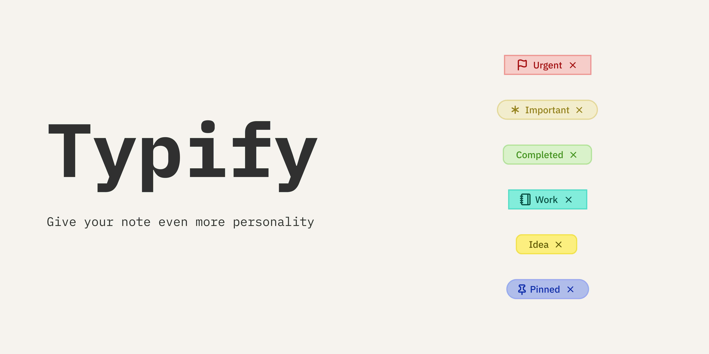

  
  
   
   

   [English](../README.md) | [Português](./README_pt.md) | [Español](./README_es.md) | Français | [简体中文](./README_zh-CN.md)

---

Transformez l'affichage de vos métadonnées ennuyeuses en un affichage dynamique et coloré ! 🎨✨

Typify est un plugin pour Obsidian qui vous permet de créer des styles uniques pour vos métadonnées. Ce qui était autrefois limité aux tags peut désormais être personnalisé pour n'importe quelle propriété Obsidian.

## Fonctionnalités

- **🎨 Styles personnalisables** : Créez des styles uniques pour vos métadonnées.

- **✨ 1700+ icônes** : Recherche floue intégrée pour toute la bibliothèque d'icônes Lucide.

- **🌑 Mode clair/sombre** : Les couleurs s'adaptent automatiquement à votre thème Obsidian.

- **🚫 Icônes optionnelles** : Support des pilules en texte seul (supprimez simplement l'icône !).

- **🧩 Icônes personnalisées** : Pas assez d'icônes ? Vous pouvez facilement utiliser les vôtres.

- **🌍 Internationalisation** : Entièrement traduit en anglais, portugais (Brésil), espagnol, français et chinois simplifié.

- **💾 Exporter/Importer** : Sauvegardez et partagez facilement vos configurations.

- **📋 Plugin Bases** : Les styles s'appliquent aussi aux vues Bases (tableau et cartes).

- **🎯 Styles ciblés** : Limitez un style à des propriétés spécifiques avec « S'applique à ».

- **🖼️ Étiquettes d'images** : Téléchargez vos propres images locales (PNG, JPG, SVG) pour les utiliser comme avatars de contact ou icônes personnalisées.

- **👁️ Masquer le bouton de suppression** : Masquez esthétiquement le bouton « X » globalement ou par vue pour créer des pilules en lecture seule.

- **♾️ Support Canvas** : Entièrement compatible avec Obsidian Canvas, avec un rendu dynamique des styles.

## Comment utiliser

1. **Définissez la propriété cible** : Dans les paramètres du plugin, tapez le nom de la propriété que vous souhaitez styliser (ex : `Status`). Pour plusieurs propriétés, séparez-les par des virgules (ex : `Status, Priority`).

2. **Créez le style de la valeur** :
   - Allez dans **Paramètres > Typify**.
   - Cliquez sur « Créer un style ».
   - Dans le champ **Nom du style**, tapez le texte que vous souhaitez transformer en pilule (ex : `Terminé`).
   - Choisissez une couleur de base et une icône, ou laissez sans icône.
   - Optionnellement, utilisez **S'applique à** pour limiter le style à des propriétés spécifiques.

3. **Utilisez votre nouveau style** : Dans les propriétés de votre note (YAML), utilisez la propriété et la valeur que vous avez configurées (ex : `Status: En cours`).

Voilà ! Votre propriété est maintenant une belle pilule colorée ✨

## Installation

### Installation manuelle
1. Téléchargez la dernière version : `main.js`, `manifest.json` et `styles.css`.

2. Créez un dossier `typify` dans le répertoire `.obsidian/plugins/`.

3. Collez-y les fichiers.

4. Rechargez Obsidian et activez le plugin.

## Avis

> [!Important]  
> L'effet de style ne s'applique qu'aux propriétés de type **Liste** dans Obsidian.

> [!Note]  
> Le plugin ne fait pas la distinction entre majuscules et minuscules, que ce soit pour le nom de la propriété ou les valeurs. Exemple : `Status` et `status` sont traités comme la même propriété.

> [!Note]  
> Si deux styles partagent le même nom mais ont des portées différentes (ex : l'un défini sur « Toutes les propriétés » et l'autre sur une propriété spécifique), le style le plus spécifique aura priorité pour cette propriété.

> [!Tip]  
> Vous pouvez utiliser plusieurs propriétés comme cibles. Ajoutez simplement une virgule entre elles. Exemple : `Status, Priority`.

> [!Note]  
> Les images personnalisées dans la vue **Bases Cards** sont intentionnellement rendues un peu plus petites (14px au lieu de 18px) pour éviter les coupures de mise en page dues aux restrictions strictes de hauteur fixe du conteneur de la carte.

> [!Warning]  
> L'importation des paramètres **remplace tous les styles existants**. Les styles créés après la sauvegarde seront perdus.

## Développement

Si vous souhaitez compiler le plugin vous-même, procédez comme suit :

1. Clonez ce dépôt.
2. Exécutez `npm install`.
3. Exécutez `npm run dev` pour démarrer la compilation en mode watch.

## Avertissement

Ce plugin est né de mon désir d'avoir plus d'options de personnalisation pour les propriétés, similaire à Notion, mais à la manière d'Obsidian.

Il convient de mentionner que sans la grande aide d'[Antigravity](https://antigravity.google/), rien de tout cela n'aurait été possible. Bien sûr, il n'y a pas eu de magie en un clic, mais un soin apporté à chaque prompt, en plus de beaucoup de révision et de tests.

Cela n'a pas été « vibécodé » n'importe comment. J'ai dû modifier plusieurs choses manuellement, mais ce n'est pas infaillible. Si vous trouvez un bug, veuillez ouvrir une issue et je ferai de mon mieux pour le corriger.

Si vous souhaitez contribuer au projet, n'hésitez pas à ouvrir une pull request. Ou si vous ne vous sentez pas à l'aise avec du code généré par machine et souhaitez faire votre propre version artisanale, n'hésitez pas non plus. Prévenez-moi simplement, car j'adore les nouveaux plugins 😉.
