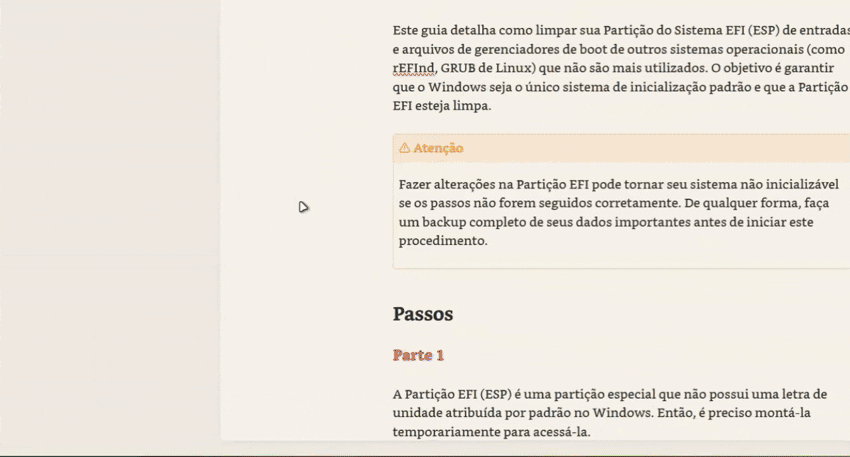

  
  
   
   

   [English](../README.md) | Português | [Español](./README_es.md) | [Français](./README_fr.md) | [简体中文](./README_zh-CN.md)

---

Transforme a visualização dos seus metadados entediantes em uma visualização dinâmica e colorida! 🎨✨

Typify é um plugin para o Obsidian que permite que você crie estilos únicos para seus metadados. O que antes era limitado apenas às tags, agora pode ser personalizado para qualquer propriedade do Obsidian.

## Recursos 

- **🎨 Estilos customizáveis**: Crie estilos únicos para seus metadados.

- **✨ 1700+ ícones**: Busca fuzzy integrada para toda a biblioteca de ícones Lucide.

- **🌑 Modo claro/escuro**: As cores se adaptam automaticamente ao tema do seu Obsidian.

- **🚫 Ícones opcionais**: Suporte para pílulas apenas com texto (basta remover o ícone!).

- **🧩 Ícones customizados**: Poucos ícones? Você pode usar os seus próprios de forma fácil.

- **🌍 Internacionalização**: Totalmente traduzido para inglês, português (Brasil), espanhol, francês e chinês simplificado.

- **💾 Exportar/Importar**: Faça backup e compartilhe suas configurações facilmente.

- **📋 Plugin Bases**: Os estilos também funcionam nas visualizações do Bases (tabela e cards).

- **🎯 Estilos por propriedade**: Limite um estilo a propriedades específicas usando "Aplica-se a".

- **🖼️ Tags com Imagens**: Faça upload de suas próprias imagens locais (PNG, JPG, SVG) para usar como avatares de contato ou ícones customizados.

- **👁️ Ocultar Botão de Remover**: Oculte esteticamente o botão "X" globalmente ou por visualização para criar pílulas de leitura.

- **♾️ Suporte ao Canvas**: Totalmente compatível com o Obsidian Canvas, renderizando os estilos dinamicamente.

- **🔗 Links Associados**: Substitui URLs nas pílulas pelo nome do estilo, mantendo o clique nativo do link.

- **😀 Ícones de Emojis**: Suporte para selecionar e utilizar emojis nativos diretamente como ícones nas pílulas.

- **🎨 Paleta de Cores**: Salve suas cores favoritas ou use as pré definições inteligente de harmonia para criar paletas perfeitas em tempo real.

- **🌐 Favicons de Links**: Associe automaticamente favicons reais de sites às suas tags de links associados, com um gerenciador seguro de cache local.

- **📰 Quadro de Novidades**: Acompanhe as atualizações e melhorias do Typify diretamente de dentro das configurações do plugin, no seu próprio idioma.

## Como Usar

É muito simples transformar suas propriedades!

1. **Nas configurações do Typify:** Adicione a propriedade para a qual você vai criar estilos personalizados (ex: `Status`).
2. **Personalize:** Clique em **Criar estilo** e defina o nome que será usado para a tag, bem como a cor, ícone (Lucide, emoji ou imagem), formato e muito mais opções.
3. **Nas suas Notas:** Usando a propriedade alvo definida anteriormente, insira junto dela o nome do estilo criado e a mágica acontece instantaneamente! ✨

### 🔗 Links Associados

O Typify permite que você crie links de propriedades muito mais bonitos. Em vez de ver uma URL feia `https://...`, você pode associá-la a um Estilo!
Se o nome do estilo for, por exemplo, "Google Tradutor" e o valor configurado no campo *Valor Correspondente* for a URL `https://translate.google.com/`, o plugin esconderá a URL e renderizará o nome "Google Tradutor" perfeitamente na pílula clicável.

## Instalação

### Instalação Manual
1. Baixe a última release: `main.js`, `manifest.json` e `styles.css`.

2. Crie uma pasta `typify` dentro do diretório `.obsidian/plugins/`.

3. Cole os arquivos lá.

4. Recarregue o Obsidian e ative o plugin.

## Avisos

> [!Warning]  
> A importação de configurações **substitui todos os estilos existentes**. Estilos criados após o backup serão perdidos.

> [!Warning]  
> O tema **Minimal** possui algumas inconsistências de layout conhecidas quando utilizado em conjunto com o plugin Typify (como tamanhos desproporcionais de fontes ou cortes de elementos). Embora eu esteja trabalhando ativamente para mitigar e resolver essas limitações em cada atualização, recomendo utilizá-lo ciente destas inconsistências temporárias.

## Roadmap

Aqui estão alguns dos recursos e melhorias planejados para futuras atualizações:

- **🎨 Pílulas Simples**: Estilos minimalistas e sem cor. Podem ser configurados ou aplicados automaticamente a valores não definidos em propriedades estilizadas.

- **🪤 Diagnóstico de Erros**: Um painel para diagnosticar problemas do plugin e gerar um relatório para facilitar a solução de problemas.

- **🏳️‍🌈 Múltiplas Cores**: Novo painel para ter e gerênciar múltiplos cartões de cores.

- **🔮 Padding da Pílula**: Ajuste o tamanho e comprimento das pílulas, bem como o tamanho da fonte e do ícone.

- **🎲 Tags Númericas**: Expansão do estilo Typify para o tipo número, permitindo a criação de estilos personalizados para tags de número.

- **📊 Pílulas de Referência**: Exibir a quantidade total de referências que aquela informação possui no seu cofre em vez de mostrar um ícone (ex: uma tag de autor exibindo "X" referências).

- ~~**🔗 Simplificação de Links**: Limpar e encurtar URLs externas exibidas nas pílulas de forma automática (ex: `www.google.com` simplificado para `google.com`).~~ --> Implementado de outra forma! :D
- ~~**🌐 Ícones de Favicon**: Opção de buscar e exibir automaticamente o favicon do site para links externos que não tenham um ícone personalizado configurado.~~ --> Implementado! :D
- ~~**🗂️ Nova Tela de Gerenciamento**: Substituir a longa lista de estilos por um esquema de abas (tabs) igual ao usado no modal de busca, incluindo suporte a rolagem horizontal quando houver muitas abas.~~~ Implementado! :D
- ~~**😀 Ícones de Emojis**: Suporte para selecionar e utilizar emojis nativos diretamente como ícones nas pílulas.~~ --> Implementado! :3

## Desenvolvimento

Caso você queira compilar o plugin, faça o seguinte:

1. Clone este repositório.
2. Execute `npm install`.
3. Execute `npm run dev` para iniciar a compilação em modo watch.

## Disclaimer

Esse plugin nasceu pelo meu desejo de ter mais opção de customização para as propriedades, igual há no Notion, mas do jeito Obsidian de ser. 

E vale dizer que sem a grande ajuda do [Antigravity](https://antigravity.google/) nada disso seria possível. Claro, não houve mágica feita com um clique, mas sim cuidado com cada prompt, além de muita revisão e testes.

Isso não foi "vibecodado" de qualquer jeito, tive que alterar várias coisas "na mão", mas não é aprova de bala. Se encontrar algum bug, por favor, abra uma issue que eu vou fazer o máximo que posso para corrigir.

Se você quiser contribuir com o projeto, sinta-se à vontade para abrir uma pull request. Ou se não sentir bem usando código gerado por máquina e quiser fazer uma versão sua feito "à mão", sinta-se à vontade também. Só lembra de me avisar, pois amo plugins novos 😉.
