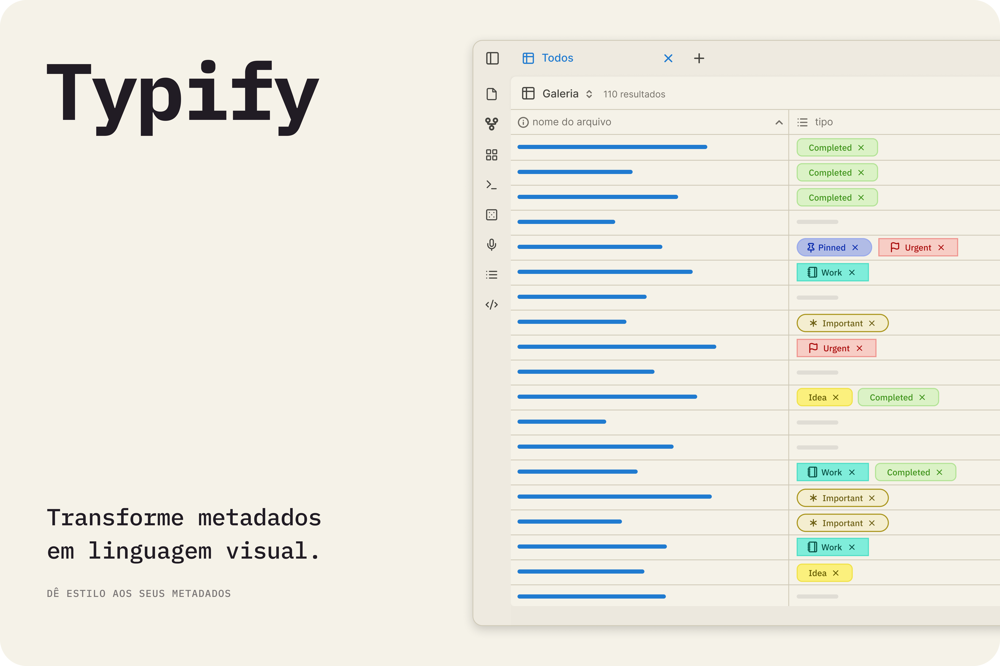
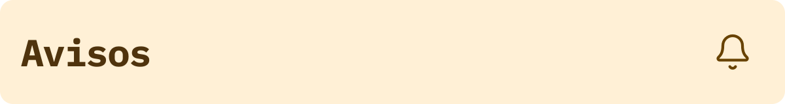
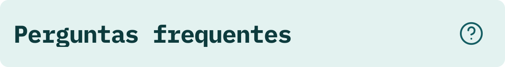

  
  
   
   
   
   

   [Inglês](../README.md) 
   | Português 
   | [Espanhol](./README_es.md) 
   | [Francês](./README_fr.md) 
   | [Chinês Simplificado](./README_zh-CN.md)

---

Transforme a visualização dos seus metadados entediantes em uma visualização dinâmica e colorida! 🎨✨

O Typify é um plugin para o Obsidian que permite que você crie estilos únicos para seus metadados. O que antes era limitado apenas às tags, agora pode ser personalizado para qualquer propriedade do Obsidian.

## 

Poderoso e simples de usar, o Typify permite que você customize suas propriedades do Obsidian da maneira que quiser, com uma variedade de opções e recursos. Alguns dos recursos incluem: 

- **Mais de 1700 ícones**
- **Três estilos de tags e formatos para escolher**
- **Ícones customizados** 
- **Cores adaptáveis para modo claro e escuro de forma automática**
- **Links customizados** 

✨ Quer ver tudo o que o Typify pode fazer? Confira a 
[lista completa de recursos e guias detalhados](features/README_pt.md).

## 

É muito simples transformar suas propriedades!

1. **Nas configurações do Typify:** Adicione a propriedade para a qual você vai criar estilos personalizados (ex: `Status`).
2. **Personalize:** Clique em **Criar estilo** e defina o nome que será usado para a tag, bem como a cor, ícone (Lucide, emoji ou imagem), formato e muito mais opções.
3. **Nas suas Notas:** Usando a propriedade alvo definida anteriormente, insira junto dela o nome do estilo criado e a mágica acontece instantaneamente! ✨

## 

1. Baixe a última release: `main.js`, `manifest.json` e `styles.css`.

2. Crie uma pasta `typify` dentro do diretório `.obsidian/plugins/`.

3. Cole os arquivos lá.

4. Recarregue o Obsidian e ative o plugin.

## 
> [!Warning]  
> A importação de configurações **substitui todos os estilos existentes**. Estilos criados após o backup serão perdidos.

> [!Warning]  
> O tema **Minimal** possui algumas inconsistências de layout conhecidas quando utilizado em conjunto com o plugin Typify (como tamanhos desproporcionais de fontes ou cortes de elementos). Embora eu esteja trabalhando ativamente para mitigar e resolver essas limitações em cada atualização, recomendo utilizá-lo ciente destas inconsistências temporárias.

## 

  
 🤔
    <b>Quais tipos de propriedades são compatíveis?</b>
  

> Atualmente o Typify estiliza apenas propriedades do tipo **lista**.

  
  
 🏷️
    <b>Por que uma propriedade não está sendo estilizada?</b>
  

> Verifique se você adicionou a propriedade nas configurações do plugin e se ela é do tipo lista. 

  
 🎨
    <b>Posso usar ícones personalizados ou do Lucide?</b>
  

> Sim! O plugin permite customizar o ícone usado. Você pode escolher usar os ícones Lúcide, ícones svg de sua preferência, emojis ou até imagens. Ah, mas lembra de ativar as opções de customização de ícones nas configurações do plugin. Além de conferir as limitações no painel de avisos do plugin :D.

  
 📱
    <b>O Typify funciona no Obsidian Mobile?</b>
  

> Sim! O Typify é compatível com o Obsidian Mobile. Então não tenha medo de organizar suas notas.

  
  
 💾
    <b>Como funciona o cache de favicons?</b>
  

> O Typify armazena localmente favicons baixados para exibir nos links. Nada é atualizado sem o consentimento expresso do usuário.

  
 🌐
    <b>O Typify envia algum dado para serviços externos?</b>
  

> Não. O plugin se comunica apenas com o serviço de recuperação de favicons quando é expressamente solicitado a busca pelo usuário. Alguns provedores são Google e DuckDuckGo(Algumas opções são melhores que outras para obtenção dos favicons).

  
 🧹
    <b>O que acontece com minhas propriedades ao desinstalar o plugin?</b>
  

> Nada. Suas propriedades vão continuar existindo no seu vault, apenas não serão estilizadas. 

  
 🎭
    <b>O Typify pode entrar em conflito com temas ou snippets CSS?</b>
  

> Não, pois o plugin não sobrescreve nenhum estilo global do tema usado ou vice-versa.

  
 📋
    <b>Como relatar um problema ou sugerir uma função?</b>
  

> Se você encontrar algum problema, por favor, abra uma issue no repositório do plugin. Farei o meu melhor para corrigir o problema o mais rápido possível.

## 
\
Aqui estão alguns dos recursos e melhorias planejados para futuras atualizações:

- **🪤 Diagnóstico de Erros**: Um painel para diagnosticar problemas do plugin e gerar um relatório para facilitar a solução de problemas.
- **🏳️‍🌈 Múltiplas Cores**: Novo painel para ter e gerenciar múltiplos cartões de cores.
- **🎲 Tags Numéricas**: Expansão do estilo Typify para o tipo número, permitindo a criação de estilos personalizados para tags de número. *(Avaliando)*
- **🔮 Padding da Pílula**: Ajuste o tamanho e comprimento das pílulas, bem como o tamanho da fonte e do ícone. *(Congelado)*
- **📊 Pílulas de Referência**: Exibir a quantidade total de referências que aquela informação possui no seu cofre em vez de mostrar um ícone (ex: uma tag de autor exibindo "X" referências). *(Congelado)*

## 
\
Caso você queira compilar o plugin localmente, faça o seguinte:

1. Clone este repositório.
2. Execute `npm install`.
3. Execute `npm run dev` para iniciar a compilação em modo watch.

## 
\
Esse plugin nasceu pelo meu desejo de ter mais opção de customização para as propriedades, igual há no Notion, mas do jeito Obsidian de ser.

E vale dizer que sem a grande ajuda do [Antigravity](https://antigravity.google/) nada disso seria possível. Claro, não houve mágica feita com um clique, mas sim cuidado com cada prompt, além de muita revisão e testes.

Isso não foi "vibecodado" de qualquer jeito, tive que alterar várias coisas "na mão", mas não é à aprova de bala. Se encontrar algum bug, por favor, abra uma issue que eu vou fazer o máximo que posso para corrigir.

Se você quiser contribuir com o projeto, sinta-se à vontade para abrir uma pull request. Ou se não se sentir bem usando código gerado por máquina e quiser fazer uma versão sua feito "à mão", sinta-se à vontade também. Só lembra de me avisar, pois amo plugins novos 😉.
