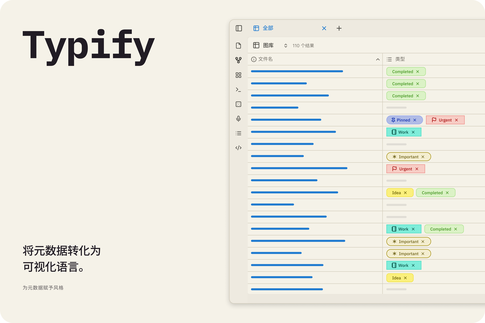
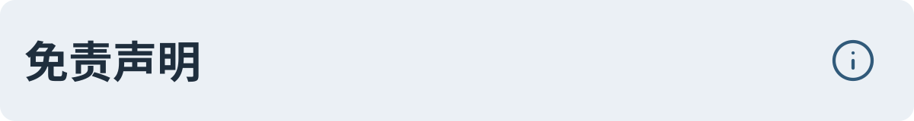

  
  
   
   
   
   

   [英语](../README.md) 
   | [葡萄牙语](./README_pt.md) 
   | [西班牙语](./README_es.md) 
   | [法语](./README_fr.md) 
   | 简体中文

---

将你无聊的元数据变成动态、多彩的展示！🎨✨

Typify 是一款 Obsidian 插件，让你可以为元数据创建独特的样式。以前仅限于标签的功能，现在可以应用于任何 Obsidian 属性。

## 

强大且易于使用，Typify 允许您以任何方式自定义 Obsidian 属性，提供多种选项和功能。以下是部分功能特性：

- **1700+ 图标**
- **三种标签样式和形状可供选择**
- **自定义图标**
- **颜色自动适配明暗模式**
- **自定义链接**

✨ 想要了解 Typify 的所有功能吗？查看
[完整功能列表和详细指南](features/README_zh-CN.md)。

## 

转换您的属性非常简单！

1. **在 Typify 设置中:** 添加您将为其创建自定义样式的属性（例如 `Status`）。
2. **自定义:** 点击 **创建样式**，并定义将用于标签的名称，以及颜色、图标（Lucide、emoji 或图像）、形状和更多选项。
3. **在您的笔记中:** 使用先前定义的目标属性，在其旁边插入创建的样式名称，魔法就会瞬间发生！ ✨

## 

1. 下载最新版本：`main.js`、`manifest.json` 和 `styles.css`。

2. 在 `.obsidian/plugins/` 目录中创建一个名为 `typify` 的文件夹。

3. 将文件粘贴到该文件夹中。

4. 重新加载 Obsidian 并启用插件。

## 
> [!Warning]  
> 导入设置会**替换所有现有样式**。备份之后创建的样式将会丢失。

> [!Warning]  
> **Minimal** 主题在与 Typify 插件一起使用时存在一些已知的排版不一致问题（例如字体大小不均或元素被裁剪）。虽然我在每次更新中都在积极解决和缓解这些限制，但在使用该主题时，请注意这些暂时的不一致情况。

## 

  
 🤔
    <b>哪些类型的属性是兼容的？</b>
  

> 目前 Typify 只支持**列表**类型的属性。

  
  
 🏷️
    <b>为什么属性没有被应用样式？</b>
  

> 请检查您是否在插件设置中添加了该属性，以及它是否为列表类型。

  
 🎨
    <b>我可以自定义图标或使用 Lucide 图标吗？</b>
  

> 是的！插件允许您自定义使用的图标。您可以选择使用 Lucide 图标、您自己喜欢的 SVG 图标、Emoji 表情符号甚至图片。但请记得在插件设置中开启自定义图标选项，同时请注意查看插件警告面板中的限制说明 :D。

  
 📱
    <b>Typify 支持 Obsidian 移动端吗？</b>
  

> 支持！Typify 完全兼容 Obsidian 移动端。因此您可以放心地整理您的笔记。

  
  
 💾
    <b>网站图标缓存是如何工作的？</b>
  

> Typify 会将下载的网站图标缓存在本地以在链接上显示。未经用户的明确同意，不会更新任何内容。

  
 🌐
    <b>Typify 会向外部服务发送任何数据吗？</b>
  

> 不会。该插件仅在用户明确请求搜索时，才会与网站图标获取服务通信。我们使用的部分服务提供商包括 Google 和 DuckDuckGo（对于获取网站图标，某些选项可能优于其他选项）。

  
 🧹
    <b>卸载插件后我的属性会怎样？</b>
  

> 什么都不会发生。您的属性将继续存在于您的库中，只是不再带有自定义样式。

  
 🎭
    <b>Typify 会与 CSS 主题或代码片段冲突吗？</b>
  

> 不会，因为该插件不会覆盖您使用的主题的任何全局样式，反之亦然。

  
 📋
    <b>如何报告问题或提出功能建议？</b>
  

> 如果您遇到任何问题，请在插件的代码仓库中提交 Issue。我会尽快修复。

## 

以下是计划在未来更新中提供的一些功能和改进：

- **🪤 错误诊断**：一个用于诊断插件问题并生成报告以协助故障排除的面板。
- **🏳️‍🌈 多种颜色**：用于拥有和管理多个颜色卡片的新面板。
- **🎲 数字标签**：将 Typify 样式扩展到数字类型，允许为数字标签创建自定义样式。 *(评估中)*
- **🔮 胶囊内边距**：调整胶囊的大小和长度，以及字体和图标大小。 *(已冻结)*
- **📊 引用胶囊**：显示该信息在你的库中拥有的总引用量，而不是显示一个图标（例如：显示 "X" 个引用的作者标签）。 *(已冻结)*

## 

如果你想在本地构建插件，请执行以下操作：

1. 克隆此仓库。
2. 运行 `npm install`。
3. 运行 `npm run dev` 以启动监视模式编译。

## 

这个插件诞生于我对属性拥有更多自定义选项的渴望，类似于 Notion，但以 Obsidian 的方式实现。

值得一提的是，没有 [Antigravity](https://antigravity.google/) 的大力帮助，这一切都不可能实现。当然，这不是一键完成的魔法，而是对每个提示词的精心打磨，加上大量的审查和测试。

这不是随意"氛围编码"出来的。我不得不手动修改很多东西，但它也不是万无一失的。如果你发现任何 bug，请提交 issue，我会尽最大努力修复。

如果你想为项目做贡献，欢迎提交 pull request。或者如果你不习惯使用机器生成的代码，想要制作自己的手工版本，也完全可以。只是记得告诉我，因为我热爱新插件 😉。
