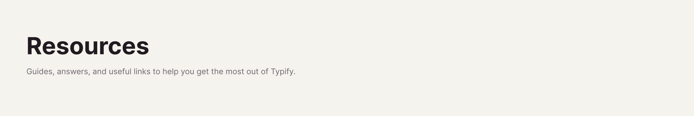

# 

[⬅️ Back to Home](../../README.md)

## 🔗 Associated Links

Typify allows you to create much cleaner property links. Instead of seeing an ugly `https://...` URL, you can associate it with a Style!

If your style name is, for example, "Google Translate" and the matched value in *Match Value* is the URL `https://translate.google.com/`, the plugin will hide the URL and perfectly render the name "Google Translate" as a clickable pill.

---

More information coming soon...
