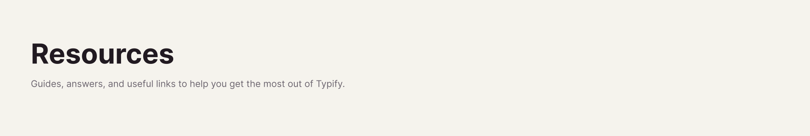

# 

[⬅️ Back to Home](../../README.md)

## 🎨 Style name and value to style

**Style name** identifies the style in the style list. **Value to style** specifies the property value that receives its appearance. If **Value to style** is left empty, the style name will be used when saving. You can enter a different value and edit the two fields independently.

For example, a style named "Completed tasks" can apply to the property value "Done". Renaming the style keeps "Done" as its target and does not change the values stored in your notes.

## 🔗 Associated links

Typify allows you to create much cleaner property links. Instead of seeing an ugly `https://...` URL, you can associate it with a Style!

With **Associated links** enabled, **Style name** also provides the display text for matching links. For example, if **Style name** is "Google Translate" and **Associated link** is `https://translate.google.com/`, the plugin shows "Google Translate" as a clickable pill while keeping the original URL. **Value to style** remains independent: the same style can apply to both a property value and an associated link.

---

More information coming soon...
