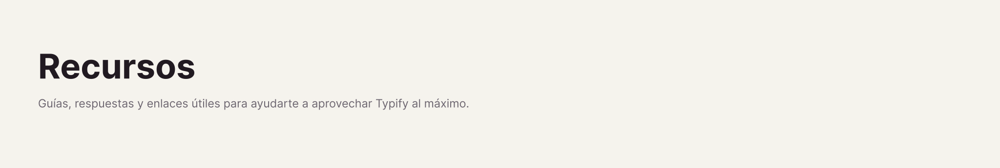

# 

[⬅️ Volver al Inicio](../README_es.md)

## 🔗 Enlaces Asociados

Typify te permite crear enlaces de propiedades mucho más limpios. En lugar de ver una URL fea `https://...`, ¡puedes asociarla a un Estilo!

Si el nombre de tu estilo es, por ejemplo, "Google Traductor" y el valor asociado en *Valor Coincidente* es la URL `https://translate.google.com/`, el plugin ocultará la URL y renderizará perfectamente el nombre "Google Traductor" como una píldora en la que se puede hacer clic.

---

Más información próximamente...
