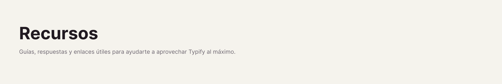

# 

[⬅️ Volver al Inicio](../README_es.md)

## 🎨 Nombre del estilo y valor que se estiliza

**Nombre del estilo** identifica el estilo en la lista de estilos. **Valor que se estiliza** define qué valor de la propiedad recibe su apariencia. Si **Valor que se estiliza** se deja vacío, se usará el nombre del estilo al guardar. Puedes introducir un valor diferente y editar los dos campos por separado.

Por ejemplo, un estilo llamado "Tareas completadas" puede aplicarse al valor "Completado". Cambiar el nombre del estilo mantiene "Completado" como valor de destino y no modifica los valores guardados en tus notas.

## 🔗 Enlaces asociados

Typify te permite crear enlaces de propiedades mucho más limpios. En lugar de ver una URL fea `https://...`, ¡puedes asociarla a un Estilo!

Con **Enlaces asociados** activado, **Nombre del estilo** también define el texto que se muestra en los enlaces coincidentes. Por ejemplo, si **Nombre del estilo** es "Google Traductor" y **Enlace asociado** es `https://translate.google.com/`, el plugin mostrará "Google Traductor" como una píldora en la que se puede hacer clic, conservando la URL original. **Valor que se estiliza** sigue siendo independiente: el mismo estilo puede aplicarse tanto a un valor de la propiedad como a un enlace asociado.

---

Más información próximamente...
