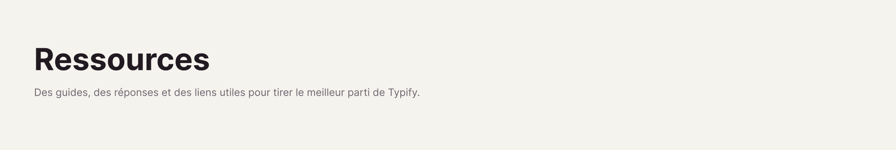

# 

[⬅️ Retour à l'accueil](../README_fr.md)

## 🔗 Liens Associés

Typify vous permet de créer des liens de propriétés beaucoup plus propres. Au lieu de voir une URL laide `https://...`, vous pouvez l'associer à un Style !

Si le nom de votre style est, par exemple, "Google Traduction" et la valeur correspondante dans *Valeur Correspondante* est l'URL `https://translate.google.com/`, le plugin masquera l'URL et affichera parfaitement le nom "Google Traduction" sous forme de pilule cliquable.

---

Plus d'informations bientôt...
