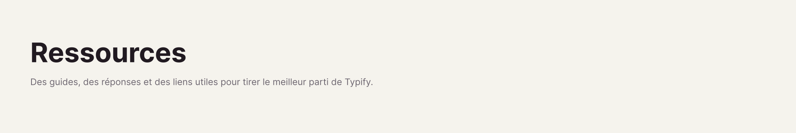

# 

[⬅️ Retour à l'accueil](../README_fr.md)

## 🎨 Nom du style et valeur à styliser

**Nom du style** identifie le style dans la liste des styles. **Valeur à styliser** définit la valeur de propriété qui reçoit son apparence. Si **Valeur à styliser** reste vide, le nom du style sera utilisé lors de l’enregistrement. Vous pouvez saisir une valeur différente et modifier les deux champs séparément.

Par exemple, un style nommé "Tâches terminées" peut s’appliquer à la valeur "Terminé". Renommer le style conserve "Terminé" comme valeur cible et ne modifie pas les valeurs enregistrées dans vos notes.

## 🔗 Liens associés

Typify vous permet de créer des liens de propriétés beaucoup plus propres. Au lieu de voir une URL laide `https://...`, vous pouvez l'associer à un Style !

Lorsque **Liens associés** est activé, **Nom du style** définit aussi le texte affiché pour les liens correspondants. Par exemple, si **Nom du style** est "Google Traduction" et **Lien associé** est `https://translate.google.com/`, le plugin affiche "Google Traduction" sous forme de pilule cliquable, en conservant l’URL d’origine. **Valeur à styliser** reste indépendante : le même style peut s’appliquer à la fois à une valeur de propriété et à un lien associé.

---

Plus d'informations bientôt...
