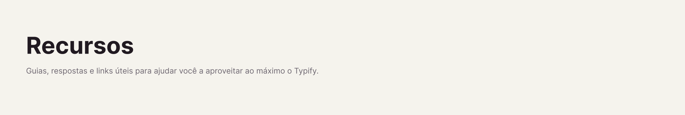

# 

[⬅️ Voltar para o Início](../README_pt.md)

## 🔗 Links Associados

O Typify permite que você crie links de propriedades muito mais bonitos. Em vez de ver uma URL feia `https://...`, você pode associá-la a um Estilo!

Se o nome do estilo for, por exemplo, "Google Tradutor" e o valor configurado no campo *Valor Correspondente* for a URL `https://translate.google.com/`, o plugin esconderá a URL e renderizará o nome "Google Tradutor" perfeitamente na pílula clicável.

---

Mais informações em breve...