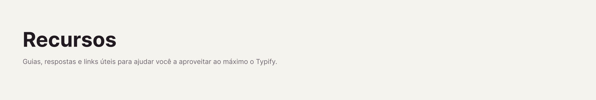
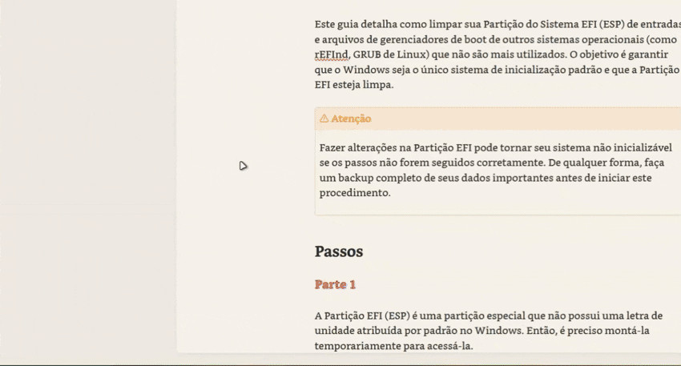

# 

[⬅️ Voltar para o Início](../README_pt.md)

## 🎨 Nome do estilo e valor a estilizar

**Nome do estilo** identifica o estilo na lista de estilos. **Valor a estilizar** define qual valor da propriedade recebe sua aparência. Se **Valor a estilizar** ficar vazio, o nome do estilo será usado ao salvar. Você pode preencher um valor diferente e editar os dois campos separadamente.

Por exemplo, um estilo chamado "Tarefas concluídas" pode ser aplicado ao valor "Concluído". Renomear o estilo mantém "Concluído" como alvo e não altera os valores armazenados nas notas.

## 🔗 Links associados

O Typify permite que você crie links de propriedades muito mais bonitos. Em vez de ver uma URL feia `https://...`, você pode associá-la a um Estilo!

Com **Links associados** ativado, **Nome do estilo** também define o texto exibido nos links correspondentes. Por exemplo, se **Nome do estilo** for "Google Tradutor" e **Link associado** for `https://translate.google.com/`, o plugin exibirá "Google Tradutor" em uma pílula clicável, mantendo a URL original. **Valor a estilizar** continua independente: o mesmo estilo pode ser aplicado tanto a um valor da propriedade quanto a um link associado.

---

Mais informações em breve...
