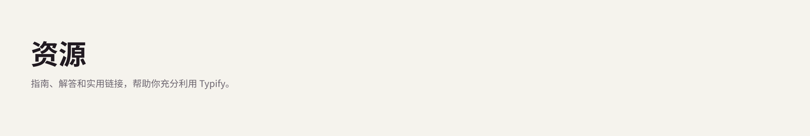

# 

[⬅️ 返回首页](../README_zh-CN.md)

## 🔗 关联链接 (Associated Links)

Typify 允许您创建更清晰的属性链接。 您无需查看难看的 `https://...` URL，而是可以将其与样式关联起来！

如果您的样式名称为 "Google 翻译"，并且在 *匹配值* 中的关联值为 URL `https://translate.google.com/`，该插件将隐藏该 URL，并完美呈现可点击的胶囊状名称 "Google 翻译"。

---

更多信息即将推出...
