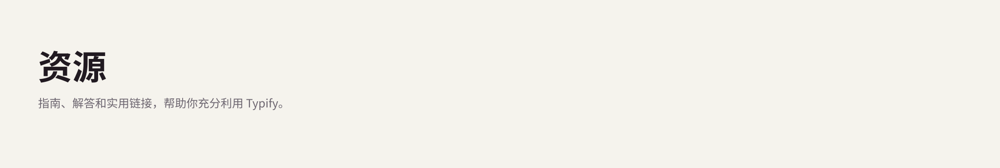

# 

[⬅️ 返回首页](../README_zh-CN.md)

## 🎨 样式名称与要设置样式的值

**样式名称**用于在样式列表中标识样式。**要设置样式的值**指定应用该样式的属性值。如果**要设置样式的值**留空，保存时将使用样式名称。您可以输入不同的值，并分别修改这两个字段。

例如，名为“已完成任务”的样式可以应用于属性值“已完成”。重命名样式后，目标值仍为“已完成”，笔记中保存的值不会改变。

## 🔗 关联链接

Typify 允许您创建更清晰的属性链接。 您无需查看难看的 `https://...` URL，而是可以将其与样式关联起来！

启用**关联链接**功能后，**样式名称**也用作匹配链接的显示文本。例如，如果**样式名称**为“Google 翻译”，**关联链接**为 `https://translate.google.com/`，插件会将其显示为可点击的“Google 翻译”胶囊，并保留原始网址。**要设置样式的值**仍是独立字段：同一样式可以同时应用于属性值和关联链接。

---

更多信息即将推出...
